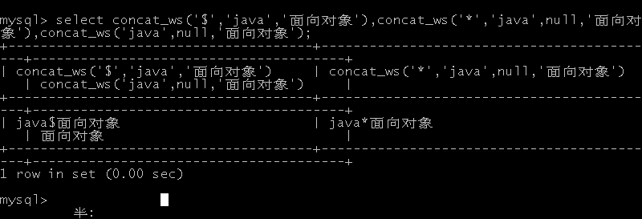
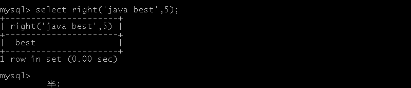
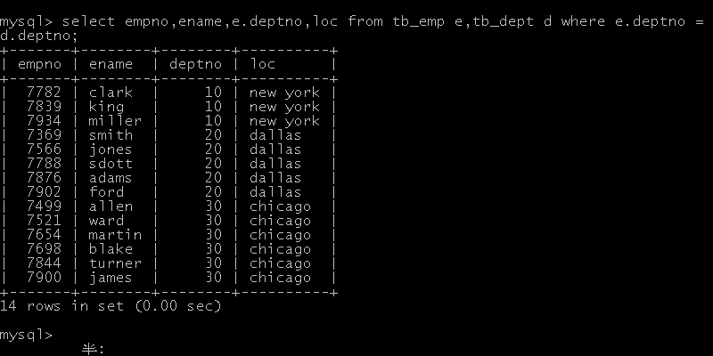
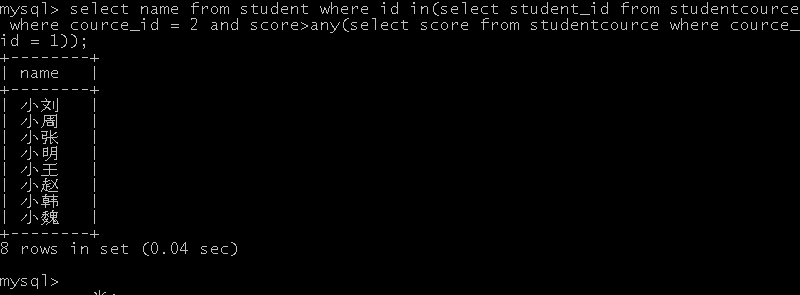

# Mysql

- 什么是数据库
  - 关系型数据库：E-R图用来描述关系型数据中的数据，E-R图又称实体关系图
    - 实体：java中类的（java中的实体对象），通常可以使用矩形描述
    - 实体属性：java中的成员属性，通常可以用椭圆描述
    - 实体与实体之间的关系：通常用菱形描述
    - Entity Relationship Diagram
  - 非关系型数据库：采用key-value方式存储数据
    - Redis数据库、MongoDB数据库
- 常见数据库
  - Oracle、Mysql、SqlServer、DB2

## Mysql数据库访问

services.msc 打开服务

- dos下进入 数据库：mysql -uroot -P3306 -hlocalhost -p;

- 显示当前所有的数据库：show databases;
- 使用数据库：use mysql;
- 显示当前数据库下的所有表：show tables;
- 显示表的结构：desc proc;||show columns from proc;
- 创建数据库：create database haospring [character set 编码];
- 删除数据库：drop database haospring;

## SQL分类

- DDL：数据定义语言，用来定义数据库对象
  - 数据库表、视图、索引
  - create、alter、drop、truncate
- DML：数据操纵语言
  - 数据库表的增加（insert）、更新（update）、删除（delete）
- DCL：数据控制语言
  - 用来完成用户权限和事务控制的语句（grant、revoke、begin、transaction、commit、rollback）
- DQL：数据查询语言
  - 完成数据的查询操作（select）

## SQL命令的使用

### 数据库的操作语句

- 创建数据库：
  - 语法格式：create database 自定义数据库名称 [character set 编码表名称];
  - [character set 编码表名称]：设置数据库的编码
  - 如果创建数据库时没有指定编码表，当前数据库会使用默认编码表
  - e.g. create database haospring character set utf8;
  - mysql数据库中utf-8表示形式为utf8；
- 删除数据库：
  - 语法格式：drop database 数据库名;
- 查看数据库创建的信息；
  - show create database haospring;
- 修改数据库的编码：
  - alter database haospring character set utf8;
- 切换数据库和查看正在使用的数据库
  - use haospring;
  - select database();

### 表的操作语句

- 创建表的语句

  - 数据库中的表相当于java中一个类
  - 表中列明相当于java中的成员变量
  - 表中的每一行数据相当于java中的实体对象
  - 数据库开发中如果想要定义表，需要定义表名、列名、每一个列的数据类型

- 语法格式：

  - create table 自定义的表名(列名 数据类型([长度]),...)

  - e.g. 创建用户表，表名为tb_user，包含字段：user_name varchar(30),user_pass varchar(50)

    ~~~mysql
    create table tb_user(
    	user_name varchar(30),
        user_pass varchar(50)
    );
    ~~~

- 数据类型

  |                      Java类型                       |                          Mysql类型                           |                             说明                             |
  | :-------------------------------------------------: | :----------------------------------------------------------: | :----------------------------------------------------------: |
  |                    String、char                     |                  varchar[长度]、char[长度]                   | char类型在数据库中是定长类型：一旦初始化长度即便存储的字符长度小于初始化长度。varchar是变长的类型：开发者存储的数据类型是多少，当前类型的长度就是多少（给定的长度内） |
  |            byte、short、int、long、float            | tineyint smallint int bigint float double | double(M,D) M代表数据的精度（整数和小数的总长度，小数点不占位），D表示小数部位 double(7,2) 12345.67符合要求 |
  |                       boolean                       |                             bit                              |                           存放0或1                           |
  |                        Date                         | date（只有日期） time（只有时间） datetime（日期和时间） timestamp（日期和时间） | datetime与timestamp表现形式上完全相同，区别在于timestamp在数据库中可以自定义更新 |
  | 大数据类型InputStream二进制文件 Reader文本文件 |       blob（存放二进制数据） text（存放文本文件）       | tinyblob、tinytext 255字节 blob 64kb mediumblob 16mb longtext 4gb |

- 说明：一般在开发中不会将文件存储到数据库表中，而是将文件存储到硬盘上，数据库表中只是存储了硬盘的访问地址

- 注意事项：mysql表中列的数据类型只有字符串类型必须描述长度

  ~~~mysql
  create table employee(
  	name varchar(30),
      age int(10),
      birthday date
  );
  show columns from employee;
  ~~~

### 单表约束

- 描述：

  - 在创建表时，需要对表中的字段进行约束限制，这个限制称为约束
  - 约束的作用：保证数据的有效性和完整性

- 主键约束（primary key）

  - 主键主要作用于某个列上，用来标注唯一
  - 目的是用来绑定某条数据（根据主键可以找到唯一对应的数据）
  - 主键修饰的数据不能重复，不能为空
  - 通常一张表只设置一个主键字段

  ~~~mysql
  create table tb_employee(
      emp_no int(30) primary key,
      emp_name varchar(30),
      emp_pass varchar(30),
      emp_birth date
  );
  show columns from tb_employee;
  ~~~

- 唯一约束（unique）

  - 设定唯一约束的字段，数据不能重复
  - 唯一约束和主键约束使用
  - 唯一约束在表中可以定义多个，主键约束在表中通常只定义一个
  - 复合主键：由两列确定主键约束

- 非空约束（not null）

  - 设置非空约束的字段，意味着该字段不能有空值；

- 自动增长（auto_increment）

  - 该约束只能定义在数值型字段，用来完成自动增长操作
  - 通常情况下该约束会与主键一起使用
  - 由它修饰的字段，无需开发者录入数据

  ~~~mysql
  # e.g. 创建表person，字段（id 主键 自动增长、name 字符串、age 数值型、email 字符串），并完成对该表的数据录入
  create table tb_person(
      id int primary key auto_increment,
      name varchar(30) unique not null,
      pass varchar(30) not null
  );
  insert into tb_person(name,pass) value('tom','123');
  insert into tb_person(name,pass) value('jerry','234');
  insert into tb_person(name,pass) value('mary','345');
  select * from person;
  ~~~

### 修改表

- 增加列

  - 语法格式：alter table 表名 add 列名 数据类型(长度) 约束;

  ~~~mysql
  # e.g. 给表tb_person增加列，列名 salary int not null
  alter table tb_person add salary int not null;
  ~~~

- 修改表的列

  - 语法格式：alter table 表名 modify 列名 类型 约束;

  ~~~mysql
  alter table tb_person modify salary varchar(20) not null;
  ~~~

  - 修改列名
  - alter  table 表名 change 旧的列名 新的列名 数据类型（长度） 约束;

  ~~~mysql
  alter table tb_person change name username varchar(30) unique not null;
  ~~~

- 删除已有的列
  - alter table 表名 drop 列名;

  ~~~mysql
  alter table tb_person drop pass;
  ~~~

- 修改表名
  - rename table 旧表名 to 新表名;

  ~~~mysql
  rename table tb_person to tb_newperson;
  ~~~

- 修改表的编码
  - alter table 表名 character set 编码;

  ~~~mysql
  alter table tb_newperson character set utf8;
  ~~~

### 数据表的删除

- 语法格式：

  - drop table 表名;

  ~~~mysql
  drop table tb_newperson;
  ~~~

- 查看数据表结构：

  - desc 表名;

  ~~~mysql
  desc tb_newperson;
  ~~~

- 查看当前数据库所有的表

  - show tables;

  ~~~mysql
  show tables;
  ~~~

- 查看建表的语句和字符集

  - show create table 表名;
  
  ~~~mysql
  show create table tb_user;
  ~~~

### 表中数据增删改查

- 描述：就是对数据表中的数据实现增加（insert）、删除（delete）、修改（update）、查询（select）

#### 增加语句

- 语法格式：

  - insert into 表名[(列名1，列名2，...)] value|values(值1，值2，...);
  - 如果是全表数据录入，表名后面的列名可以省略不写
  - 如果不是全表数据录入，需要在后面描述录入数据的列名
  - value或values中所描述的数据必须和表中的字段一一对应（值必须与列的类型相对应，值的大小必须满足列的大小）
  - 如果录入语句value描述的一位置但行录入，如果是values意味着批量录入（多行录入）
  - 字符串和日期类型在录入数据时，由单引号描述
  - 插入空值可以写null
  - 如果主键是int类型，并且设定了自动增长，插入数据时可以给主键字段赋值null

  ~~~mysql
  # 创建学生表，拥有id pk auto，姓名、年龄、性别、成绩、出生日期，完成数据录入
  create table tb_student(
      id int primary key auto_increment,
      name varchar(30),
      age int,
      gender varchar(30),
      score double,
      birthday date
  );
  # 非全表数据录入
  insert into tb_student(name,age,gender,score,birthday)
  value('赵四',20,'男',59.9,'1997-09-09');
  # 全表数据录入
  insert into tb_student value('张三',21,'男',60.0,'1996-10-10');
  # 多行录入
  insert into tb_student values
  (null,'Tom',21,'男',78.5,'1999-10-15'),
  (null,'Jerry',20,'男',85,'2000-03-14'),
  (null,'Rose',21,'女',77,'1999-11-02'),
  (null,'Mary',21,'女',94,'1999-08-30'),
  (null,'Jack',20,'男',59,'2000-06-06');
  ~~~

#### 更新数据

- 语法格式：update 表名 set 列名1=值1，列名2 = 值2，... where 条件语句

- 注意事项：

  - 修改操作通常必须描述where条件，如果开发者不描述where条件意味着全表数据更新
  - e.g. 将学生表中所有的年龄更新为18

  ~~~mysql
  update tb_student set age = 18;
  ~~~

  - e.g. 将姓名为Tom的学生成绩修改为100

  ~~~mysql
  update tb_student set score = 100 where name = 'Tom';
  ~~~

  - e.g. 将学生编号为1的学生姓名更新为Jack

  ~~~mysql
  update tb_student set name = 'Jack' where id = 1;
  ~~~

  - e.g. 将Tom的成绩减去50分

  ~~~mysql
  update tb_student set score = score-50 where name = 'Tom';
  ~~~

#### 删除数据

- 语法格式：delete from 表名 where 条件;

- 注意事项：where条件可以不定义，意味着表中所有的数据都删除，通常情况下慎重

  - e.g. 删除表中姓名为Tom的学生信息

  ~~~mysql
  delete from tb_student where name = 'Tom';
  ~~~

- 总结：如果开发者想要删除表中所有的数据，可以使用truncate table 表名;它的效果等价于delete from 表名;

- truncate与delete的区别
  - truncate删除数据先将整个表删除掉，再重新生成表，数据无法恢复
  - delete删除数据，是逐行删除，数据可恢复
  - truncate删除的效率高于delete
  - truncate属于DDL（不可恢复），delete属于DML（可通过事务回滚恢复）
  
- drop table 表名;

  - 删除整个表，包括表结构

#### 数据查询

- 语法格式一：select [distinct] * | 列名1，列名2，... from 表名；

  - [distinct]用于去除查询中的重复数据
  - select * from 表名;——查询整张表的数据
  - select 列名，列名 from 表名;——查询表中指定列所对应的数据
  - e.g. 查询所有的学生信息

  ~~~mysql
  select * from tb_student;
  ~~~

  - e.g. 查询学生的姓名、年龄、性别、成绩、出生日期，并对姓名去除重复项

  ~~~mysql
  select distinct name,age,gender,score,birthday from tb_student;
  ~~~

- select 表达式（列执行运算） from 表名;

  - e.g. 给查询到的所有成绩加10分

  ~~~mysql
  select name,score+10 from tb_student;
  # 表中的所有数据没有发生任何改变
  ~~~

  - 给列定义别名
  - select 列名 [as] 别名 from表名;
  - as可以省略不写

  ~~~mysql
  select name as username from tb_student;
  select name username from tb_student;
  ~~~

  - 说明：在本用例中仅仅是在查询显示信息时才给成绩加10分，原表中的成绩并没有变化

- 查询语法格式三：

  - select 列名 from 表名 where条件语句;
  - e.g. 查询成绩大于等于65的学生信息

  ~~~mysql
  select * from tb_student where score >= 65;
  ~~~

  - 说明：
    - 相等 = 
    - 不等于 <>
    - between ... and... 在两者之间取值，通常都是用来完成区间查询
    - in(值1，值2，值3)：在给定的值中任取一个or、||
    - not in()不在指定的范围内
  - e.g. 查询成绩在78.5到94之间的学员成绩

  ~~~mysql
  select * from tb_student where score between 78.5 and 94;
  select * from tb_student where id in(5,6,7);
  select * from tb_student where id = 5 or id = 6 or id = 7;
  select * from tb_student where id = 5||id = 6||id = 7;
  ~~~

- 模糊查询

  - %：代表占位符，可以和任意的字符串一起使用
  - _：代表任意的单个字符
  - e.g. 查询姓名中包含字母o的学员信息

  ~~~mysql
  select * from tb_student where name like '%o%';
  select * from tb_student where name like 't%';
  select * from tb_student where name like 't__';
  ~~~

- is null：判断该列是否为空值

  - e.g. 查找年龄为空的学员信息

  ~~~mysql
  select * from tb_student where age is null;
  select * from tb_student where age is not null;
  ~~~

- and逻辑与  or逻辑或  not逻辑非

- order by

  - select * from 表名 order by 列名 asc|desc;
  - asc：升序排列（默认）
  - desc：降序排列
  - e.g. 对学生排序，然后显示排序后的学生信息

  ~~~mysql
  select * from tb_student order by score desc;
  select * from tb_student order by score;
  select * from tb_student order by score , age desc;
  ~~~

### SQL中的函数

  - 描述：聚集函数（聚合函数）：分成为分组函数，主要引用sql中自带的函数，完成分组数据的统计；

  - 语法格式：select function(列) from 表名;

      - count函数
          - 作用：统计查询结果的记录数
          - 语法格式：select count(*)|count(列名) from 表名;

    ~~~mysql
    # 统计学生表中一共有多少学生
    select count(*) from tb_student;
    # 统计考试成绩及格的学生人数
    select count(*) from tb_student where score >= 60;
    ~~~

    - sum函数
      - 作用：统计某一列数据的和；
      - 语法格式：select sum(列名) from 表；

    ~~~mysql
    # 统计学生的成绩和
    select sum(score) from tb_student;
    # 统计年龄与成绩的和
    select sum(score),sum(age) from tb_student;
    # 统计学生年龄和成绩的和值
    select sum(score+age) from tb_student;
    ~~~

    - 说明：如果统计的数据中存在null，mysql中null与其他数据参与运算时，运算的结果还是null；所以在开发中为了避免这个问题，开发者选择使用ifnull函数，该函数的作用如果遇到null则可以赋值

    ~~~mysql
    select sum(ifnull(age,0)+ifnull(score,0)) from tb_student;
    ~~~

    - avg函数
      - 作用：统计某一列的平均值；
      - 语法格式：select avg(列) from 表;

    ~~~mysql
    # 统计学生的平均成绩
    select avg(score) from tb_student;
    select avg(ifnull(score,0)) from tb_student;
    ~~~

    - max、min函数
      - 作用：max统计一列最大值
      - min统计一列最小值

    ~~~mysql
    # 统计学生的最高分和最低分
    select max(score) 最高分,min(score) 最低分 from tb_student;
    ~~~

- 说明：上述的函数在使用时是根据表中某一列进行计算，这种计算函数不能出现在where后面作为条件

#### 分组

- 描述：根据表中某列的特点，对表的数据进行分组显示；

- 语法格式：select 分组函数 from 表 group by 列名;

  ~~~mysql
  # 创建订单表orders（编号、商品、价格）
  create table tb_orders(
  	id int,
      product varchar(20),
      price float
  );
  # 录入数据
  insert into tb_orders values
  (1,'电视',900),
  (2,'洗衣机',100),
  (3,'洗衣粉',9),
  (4,'冰箱',600),
  (5,'洗衣粉',9);
  # 对订单表中的商品归类，显示每一类商品的总价
  select product,sum(ifnull(price,0)) from tb_orders group by product;
  # 查询购买的几类商品，但是每类商品的价格总和大于100
  select product,count(product),price from tb_orders group by product having sum(price)>100;
  # 聚合函数不能和where条件一起使用，如果开发者必须在分组时定义条件，可以使用关键字having
  ~~~

- 总结：where和having的区别

  - where条件是在分组前所使用的条件，having是在分组后所使用的条件关键字
  - where后面不能出现分组函数（聚合函数），having后面可以使用分组函数

- 总结：查询语句的执行顺序：

  - s...f...w...g...h...o...
  - select... from... where... group by... having... order by
  - 执行书序：f...w...g...h...o...s

#### SQL中的其他函数

- 描述

  - 函数如果从分类这个角度来说可以分为两类：
  - 单行函数和多行函数（plsql、存储过程、 触发器等）

- 单行函数

##### 数学函数

  ~~~mysql
# 绝对值
select abs(2),abs(-3.5),PI();# 2 3.5 3.141593
# 平方根
select sqrt(4),sqrt(-4);# 2 null
# 取余
select mod(5,2),mod(4,2);
# 四舍五入
select round(3.4),round(3.5),round(-3.5);# 3 4 -4
# 截取函数，舍弃小数点，通过参数指定
# 2.5	2.54	2.540	0
select truncate(2.54,1),truncate(2.54,2),truncate(2.54,3),truncate(-1,0);
  ~~~

  说明：平方根只能对正数进行操作，负数不可以，值为null

  说明：在开发中，一个中文汉字占用三个字节，一个字母或数字占用一个字节（utf8编码时，非utf8下占两个字节）

##### 字符串函数

~~~mysql

# 返回字符串包含字符的个数（char_length(str))
select char_length('java');# 4
select char_length('你好');# 2
# length(str)返回字符串的字节长度
select length('abc'),length('你好啊');# 3 9
# concat(参数1，参数2...)如果参数为null，则返回null，该函数是用来完成字符串的拼接
# java面向对象，null
select concat('java','面向对象'),concat('java',null,'面向对象');
# 在拼接的过程中添加分隔符号(concat_ws(参数1，参数2...))，如果出现null，可以忽略null
select concat_ws('$','java','面向对象'),concat_ws('*','java',null,'面向对象'),concat('java',null,'面向对象');
~~~

  

  - insert(str1,s,len,str2)插入字符串
    - str1：原字符串
    - s：索引
    - len：被替换字符串的长度
    - str2：用来替代原字符串的字符串
  - left(s,n)获取字符串长度
    - 根据指定的参数s开始获取左边n个字符
  - righ(s,n)
    - 根据指定的参数s获取右边n个字符

  

  - replace（str,s1,s2)
    - s：原字符串
    - s1：原字符串具体的字符
    - s2：用来替换的新字符

  )

  - subString(str,n,len)
    - s：原字符串
    - n：起始位置
    - len：截取长度
    - 字符串中空格也占位，截取时包括起始位置所对应的字符

  )

##### 日期和时间函数

  - 日期和时间是分开描述的，所以开发者在选择函数时一定要注意是日期还是具体的时间
  - curdate()、current_date()获取当前日期的函数
      - 两个日期函数基本都是按照yyyy-MM-dd或者是yyyyMMdd格式显示
      - 如果开发者在函数后面加0，则会将日期转换成数值进行显示

 %E5%92%8Ccurrent_date())

- now()获取当前时间，时间显示的同时，也可以显示日期
  - 格式：yyyy-MM-dd hh:mm:ss
  - 格式：yyyyMMddhhmmss

 **)**

- 显示时间的函数：curtime()和current_time()
  - 格式1：hh:mm:ss
  - 格式2：hhmmss

 和current_date())

- 数据库中日期和时间的固定格式（格式）：
  - HOUR - 小时  MINUTE - 分钟  SECOND - 秒  MICROSECOND - 毫秒  MONTH - 月  DAY-日  WEEK - 周  QUARTER - 季
  - DAY_HOUR  日和小时
  - DAY_MINUTE 日和分钟
  - 可以根据上述固定的方式来完成日期和时间的计算，给时间或日期做相加或相减运算
  - DATE_ADD(date,interval expr unit)
    - interval：用来计算的间隔关键字
    - expr：表达式，对应的就是具体的类型（e.g. MONTH）
    - unit：间隔时间的单位

 ****

##### 流程控制函数

- case()

- if()
- ifnull()

##### 其他函数

- select user();查看当前用户
- select version();查看数据库版本
- select md5('123456');密码加密
- limit();限制记录的行数
  - 通过limit的设置，可以帮助开发完成指定记录的显示
  - 根据设定的数值来显示对应的查询数据
  - select * |列名 from 表名 limit start,end;
  - start：表示起始从第几行开始
  - end：表示一共查询几条记录
  - 在数据表中起始行下标从0开始

 

### 多表查询

#### 表的约束

##### 单表约束

- primary key
- unique
- not null
- auto_increment

##### 多表约束

- foreign key：外键约束，通常情况下用于夺标关联，与主键形成关联关系

~~~mysql
# e.g. 创建tb_person表（id int pk ,name varchar(30）,address varchar(50));
# e.g. 创建tb_idcard表（id int pk auto,number varchar(18)，pid int );
# 表建立完成后修改增加外键约束
alter table tb_emp add constraint foreign key(deptno) references tb_dept(deptno);
# 删除约束
# ALTER TABLE tb_emp DROP FOREIGN KEY 'deptno'
ALTER TABLE user_order DROP FOREIGN KEY 'user_id';
~~~

人员信息表：

 

身份证信息表：

 

查询idcard表中'356879458123698456'对应的pid

 

 

- foreign key(外键字段) references 主表表名（主键字段）
  - foreign key(pid) references from tb_person(id)

 

- 说明：如果表和表之间存在主外键关系映射，需要注意如下事项：
  - 删除数据时，先删除外键表数据，再删除主键表数据，否则会出现错误，违背主外键约束
  - 数据录入时，先要录入主表数据，才能录入与之关联的外键表数据

##### 数据库表的关系

###### 一对一

- tb_person与tb_idcard，这两张表从表关系上描述，应该是一对一
- 开发者应该在外键字段上添加单行约束unique（唯一）

###### 一对多

- 表 tb_user用户表（id pk auto，username v，address v，email v）

- 表tb_orders订单表（id pk auto，price double，uid int fk）

     

     

- 说明：用户表（tb_user）与订单表（tb_orders）二者之间是一对多的关系，一个用户对应多个订单

     

###### 多对多

- 订单表（tb_orders）
- 商品表（tb_goods idpk auto，name v，number int，price double）

- 说明：如果开发中遇到多对多的表关系，可以使用中间表，中间表封装的字段通常都是另外两张主表的外键字段
- tb_pg（id pk，name v，salary d）
- tb_project（id pk，name v）
- 定义中间表tb_pg_pr（pgid int，prid int）

#### 多表关联查询

- 描述：多个表之间通过一定的连接条件，使表和表之间产生关联，通过这种关联条件可以获得多表的数据查询
- 语法格式：select 表名1.列名 = 表2.列名，... from 表名1，表名2，... where 表名1.列名 = 表名2.列名
- 连接类型：等值连接和非等值连接
- 其他分类方式：外部链接和内部连接
- 笛卡尔积：
  - 第一张表所有的行和第二张表所有的行发生连接（行*行）
  - 当连接条件在 查询中可以省略；
  - 连接条件无效；
  - 通常情况下，开发中不推荐笛卡尔积的查询方式，建议必须在关联查询语句中定义where条件

 

 

- 等值连接
  - e.g. 查询所有员工的编号、姓名、部门编号、工作地点

 

 

- 非等值连接查询
  - e.g. 每个员工的姓名、工资、工资级别

- 自身连接
  - 也可以称为自连接，是一张表通过自身的列和本身其他列等值连接的一种方式
  - 通常开发中开发者可以模拟多表关联，对同一张表进行多个别名定义
  - e.g. 查询每个员工的姓名和上级的姓名

- 交叉连接（与笛卡尔积的结果一样）：cross join
  - e.g. select e.ename,e.empno,d.deptno from tb_emp e cross join tb_dept d;
- 自然连接（using与on）
  - 对两个表之间相同的名字和数据类型的列进行等值连接
  - 如果开发者在使用自然连接时，表中列名和数据类型不相同则会报错
  - 语法格式：select 列名1，列名2... from表名1 natural join 表名2；

- 外部连接
  - 左外连接和右外连接
  - 左外连接：以from子句左边的表为基表（基础表|主表），该表所有的行数据按照连接条件无论是否匹配，基表的数据都会被显示出来
    - left outer join on(等值条件)
  - 右外连接：以from子句右边的表为基表，该表所有的行数据按照连接条件无论是否匹配，主表的数据都显示
    - right outer join on(等值条件)
  - e.g. 查询所有员工的姓名、部门编号、部门名称

​	查询所有员工的姓名、部门编号、部门名称，显示时包括没有员工的部门也要显示出来

- 内连接

  - 描述：内连接的使用是为了筛选符合条件的数据，在查询过程中需要将重复或无效的数据过滤掉；开发者秉承内连接查询必须保障数据查询要有价值

  - 两种书写方式：

    - inner join 书写相关条件
    - select * from 表名 inner join 表名 on条件

     

    - 使用where关键字书写条件

     

- 全连接（全外链接）

  - 描述：将左连接和右连接结果合并在一起称为全外链接（开发者要去除重复数据）
  - 语法格式：select * from 表名 left join 表名 on 条件 
  - union
  - select * from 表名 right join 表名 on 条件;
  - 说明：将左外连接和右外连接合并到一起
  - union：该关键字是用来合并左外和右外的，该关键字后面可以跟all关键字，如果没有all代表去除重复项
  - union all：多个查询合并到一起，但是不去除重复项

****

- 导入sql脚本：
  - source 脚本所在的盘符地址
  - source d://b.sql;

（1）in 和 exists关键字

子查询

exists关键字：

说明：主要用于判断，主要用于查询语句中；在嵌套查询中，如果嵌套的查询子句成立，则exists为true，主查询语句则执行，否则为false；

（2）any、some、all关键字

说明：any和some本质上没有什么区别，在sql语法中就是历史版本的问题（版本演变出现替换的关键字）

any|some主要用来强调多个条件中的一部分；类似min函数的使用，any(1，2，3)

all多个条件的所有，类似于max函数

e.g. 查询获得最高分的学生的学号

e.g. 查询编号为2的课程比编号为1的课程成绩高的所有学号

## 练习

1. 查询大于平均成绩的同学的学号和姓名

2. 查询所有同学学号、姓名、选课数、总成绩

3. 查询上过李彦宏老师课的学生姓名、学号

4. 统计每门课程学生选修人数（超过两人以上才统计）

