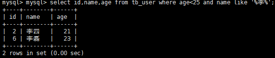

# Mybatis

## 1.mybatis介绍

**ORM**：（Object Relational Mapping）对象关系映射，是一种开发技术，也是实现面向对象的编程思想，它会将对象和数据库表形成映射关系，从而实现对对象中的数据操作映射到数据库表的数据操作

mybatis就是该思想（ORM）下一个持久层（数据操作）框架，支持定制化sql、存储过程、高级映射，mybatis几乎可以替代所有的jdbc代码和开发者手动完成数据集获取的过程

mybatis可以通过简单地xml或者是注解编程来完成java域数据库的映射

## 2.maven下mybatis的环境搭建

### 核心配置文件

mybatis的核心配置文件用来配置mybatis的核心参数，在后期的学习中该文件的大部分内容会交给spring来进行管理

标签描述：

**properties：**用来引用数据库访问基本信息的文件（jdbc.properties）

**environment：**配置数据库访问环境；通过嵌套标签environment完成数据库环境描述，该嵌套标签可以有多个

**mappers：**引用mybatis管理sql的映射文件（封装sql语句的xml文件）

### mapper映射文件

描述：

mapper映射文件主要用来配置sql语句，通常开发者在命名时可以自定义名称，但是推荐命名方式是实体类类名开头 ，Mapper结尾；例：userMapper、orderMapper

标签描述：

**mapper：**它的属性namespace，用来描述自定义的名称，通常该名称可以将实体类类名作为该名称（类名的第一个字母小写），该名称会在程序当中使用，通过该名称找到想要执行的sql语句（例：user.queryUser），在mapper标签中可以通过不同的sql标签完成sql语句的定义：

**select：**代表封装的sql语句是查询语句，该标签常用属性：

​	id：每个sql标签的唯一标识，开发者可以通过namespace属性值绑定当前id属性值来完成sql的执行

​	parameterType：用来描述sql语句需要传递的参数类型

​	resultType：sql语句执行完毕，返回的结果集的类型

### mybatis的工作原理

步骤

（1）mybatis在启动时会先读取指定的核心配置文件（mybatis-config.xml）

（2）在读取核心配置文件时，会根据核心配置文件中mappers标签完成sql加载；可以完成数据库环境加载

（3）mybatis核心配置文件加载完毕后，mybatis会构建出核心对象：SqlSessionFactory

（4）通过SqlSessionFactory获取到与数据的连接对象SqlSession（sql会话）

（5）通过SqlSession读取映射文件中（***Mapper.xml）的sql语句，完成对数据库的具体操作

~~~java
String resource = "mybatis-config.xml";
InputStream is = Resources.getResourceAsStream(resource);
// 获取mybatis的核心对象
SqlSessionFactory ssf = new SqlSessionFactoryBuilder().build(is);
// 获取SqlSession对象
SqlSession ss = ssf.openSession();
// 获取查询结果
Order order = ss.selectOne("order.queryOrder", 1);
~~~

### 3. 增删改查

### 4. mybatis的代理方式

（4.1）mybatis的代理介绍

在开发中mybatis框架代理模式指代的是程序中dao层代理模式，通常daoceng都具备接口，所以需要使用代理

java代理机制

定义dao接口

Interface UserDao{

​	接口中的抽象方法

}

定义dao中接口的实现类

Class UserDaoImpl Implements UserDao{

​	实现接口中的所有的抽象方法

}

mybatis中的代理机制（接口的抽取）：开发者只需要告诉mybatis接口是谁，mybatis会自动生成接口的实现类，所以开发者只需要开发接口即可

mybatis在使用代理机制时注意事项：开发者需要在***Mapper.xml中，namespace属性定义为dao接口的全路径（就是接口的包名）；使用SqlSession中的getMapper方法获取代理类

（4.2）将上面对tb_user用户的功能操作全部抽取为接口，通过mybatis代理方式完成

（4.2.1）dao层的定义（接口抽取）

~~~java
package com.neu.dao;

import java.io.IOException;

public interface UserDao {
	public void addUser(User user) throws IOException;

	public void deleteUser(int id) throws Exception;

	public void updateUser(User user) throws Exception;

	public void selectUserById(int id) throws Exception;

	public void queryAll() throws Exception;
}
~~~

（4.2.2）mapper文件编写

~~~xml
<!-- 当开发者使用mybatis代理模式时，需要namespace属性描述接口的包，包名.接口名 -->
<!-- 在每一个sql标签上的id属性，必须和接口中方法名完全对应 -->
<mapper namespace="com.neu.dao.UserDao">
	<select id="queryUserById" parameterType="int" resultType="com.neu.pojo.User">
		select * from tb_user where id = #{id};
	</select>
</mapper>
~~~

### 5. 动态SQL

描述：mybatis为开发者提供的sql拼接的方式，动态sql基于OGNL表达式

（5.1）if

查询年龄小于25且姓名中包含李的id，name，age

完成接口定义：

~~~java
public List<User> selectUser(@Param("age")int age,@Param("name")String name) throws SQLException;

~~~

~~~xml
<mapper namespace="com.neu.dao.UserDao">
	<!-- 
      通过标签select完成查询语句的封装，该过程或出现动态sql的拼接：
      注意事项： id属性描述的信息必须与接口中方法名一致;
          resultType属性描述方法返回值中实体的类型（无论返回集合还是普通的实体类）;
          动态sql中if的使用;
    &lt; 等价于<;
    if标签的属性test用来描述表达式，返回值类型为boolean类型；
        -->
    <select id="selectUser" resultType="com.neu.pojo.User">
      select * from tb_user where age &lt; #{age}
      <if test="name!=null">
       and name like #{name}
      </if>
    </select>
</mapper>
~~~

（5.2）choose、when、otherwise

描述：这一住mybatis标签使用和java中的switch结构非常类似；

shoose：标记范围（相当于switch）

when：相当于switch中的case加break的效果

otherwise：相当于switch中的default

需求：查询男性用户（表中1代表男性，2代表女性）；用户输入年龄，开发者查询小于用户输入年龄的信息，同时对用户的姓氏进行查询

~~~java
public List<User> selectUser1(@Param("age")int age,@Param("name")String name,@Param("user_name")String user_name);
~~~

~~~xml
<select id="selectUser1" resultType="com.neu.pojo.User">
    select * from tb_user where sex=1
    <choose>
        <when test="age!=null and age!=''">
            and age &lt; #{age}
        </when>
        <when test="name!=null and !=''">
            and name like #{name}
        </when>
        <otherwise>
            and user_name like #{username}
        </otherwise>
    </choose>
</select>
~~~

（5.3）where

描述：通常在数据库中where用来添加sql的过滤条件，如果没有where条件通常完成的都是全表操作；where条件在sql开发中拼接条件很麻烦，mybatis通过where标签可以解决拼接问题

需求：查询用户数据，如果用户输入的是性别就按照性别查询、如果用户输入的是姓名就按照姓名查询，如果用户什么都没有输入就查询所有

~~~java
public List<User> selectUser2(@Param("sex")Integer sex,@Param("name")String name);
~~~

~~~xml
<select id="selectUser2" resultType="com.neu.pojo.User">
    select * from tb_user
    <where>
        <if test="sex!=null">
            and sex=#{sex}
        </if>
        <if test="name!=null">
            and name like #{name}
        </if>
    </where>
</select>
~~~

（5.4）set

需求：开发中需要更新数据，而更新的字段根据用户的输入完成更新字段的拼接；mybatis可以他通过set标签结合if标签完成根据用户输入的信息更新具体列所对应的数据

~~~java
public void updateUser(User user);
~~~

~~~xml
<update id="updateUser" parameterType="com.neu.pojo.User">
    update tb_user
    <set>
        <if test="name!=null and name!=''">
            name=#{name},
        </if>
        <if test="age!=null and age!=''">
            age=#{age},
        </if>
    </set>
    <!-- 通常的更新语句一定具备where条件，如果没有where条件完成的是全表更新 -->
    where id=#{id}
</update>
~~~

（5.5）foreach

需求：按照指定的id范围查询对应的用户信息

~~~mysql
select * from tb_user where id in(1,2,3,4,5,6);
~~~

~~~java
public List<User> selectUser3(@Param("ids")List<Integer> ids);
~~~

~~~xml
<select id="selectUser3" resultType="com.neu.pojo.User">
    select * from tb_user where id in
    <!-- 
      foreach标签用来完成sql语句的拼接，该标签可以接收集合类型的参数，
      将集合中的值拼接到sql语句中：
      collection属性：用来描述集合的名称；
      item属性：用来接收集合中具体的数据；
      open属性：用来描述集合数据显示的语法格式或符号；
      close属性：用来描述集合数据显示的语法格式或符号；
      separator属性：属性值之间的符号；
      -->
    <foreach collection="ids" item="id" open="(" close=")" separator=",">
        #{id}
    </foreach>
</select>
~~~

### 6. 高级查询

描述：mybatis的高级查询主要针对的是一对一、一对多、多对多的查询操作

（6.1）resultMap标签的使用

resultMap属性是mybatis中重要强大的属性，通过该属性可以解决两个问题：

解决实体类属性名和表中字段名不一致的问题

完成高级查询（一对一、一对多、多对多）

（6.1.1）实体类属性名和表中字段名不一致的问题

~~~java
public User queryUser(Integer id);
~~~

~~~xml
<?xml version="1.0" encoding="UTF-8" ?>
<!DOCTYPE mapper
        PUBLIC "-//mybatis.org//DTD Mapper 3.0//EN"
        "http://mybatis.org/dtd/mybatis-3-mapper.dtd">
<mapper namespace="com.neu.dao.UserDao">
	<!-- 
		通过给查询字段定义别名模拟实体类成员变量和表中字段不一致的情况
		定义resultMap映射的格式：
		type属性：描述查询结果需要映射到的实体类（通常是包名.类名）
		id属性：给resultMap元素定义唯一的标识，因为在真正需要的sql语句中会引用
		autoMapping属性：描述没有指定的类名是否会自动映射，默认为true
	 -->
	 <resultMap type="com.neu.pojo.User" id="userMap" autoMapping="false">
	 	<!-- 
	 		id标签：用来定义查询结果中唯一的标识，就是表中的主键，并通过
	 		表中主键与类中的属性对应关系
	 			column属性：用来描述表中的字段（列名）
	 			property属性：用来描述类中的属性名
	 		result标签：用来描述表中其它字段（列名）和类中其它属性对应关系
	 	 -->
	 	 <id column="id" property="id"/>
	 	 <!-- nm是模拟类名与属性名不一致所定义的列的别名 -->
	 	 <result column="nm" property="user_name"/>
	 	 <result column="a" property="age"/>
	 	 <result column="s" property="sex"/>
	 	 <result column="name" property="name"/>
	 	 <result column="birthday" property="birthday"/>
	 </resultMap>
	 <select id="queryUser" parameterType="int" resultMap="userMap">
	 	select id,user_name nm ,age a,sex s,name,birthday 
	 	from tb_user where id=#{id}
	 </select>
</mapper>
~~~

说明：当autoMapping为true时，只有表中的列名和类中的属性名一致时，就会完成自动映射（自动赋值），如果为false，即便表中列名与属性名一致，也无法实现自动映射，需要开发者通过result标签完成列名与类中的属性名的对应描述；

autoMapping默认值为true；

（6.2）高级映射

（6.2.1）一对一：两种实现方式

方式一：继承

方式二：引用

### 7. spring和mybatis的整合

1. 什么是框架整合

   描述：将不同的层的框架放到一起进行项目开发，而在这个知识点中主要介绍的是spring、mybatis两个框架的整合；后期会接触到spring mvc，通过spring mvc、mybatis、spring三个框架整合到一起完成企业开发；

   spring mvc：主要用来完成web层的应用（类似于传统的servlet）

   mybatis：主要用来完成持久层（dao）的应用

   spring：相当于桥梁，可以将不同的框架最终连接起来，进行综合使用

2. 整合SM框架（spring、mybatis）

   （1）创建maven工程，引入依赖，主要导入spring和mybatis的依赖包

