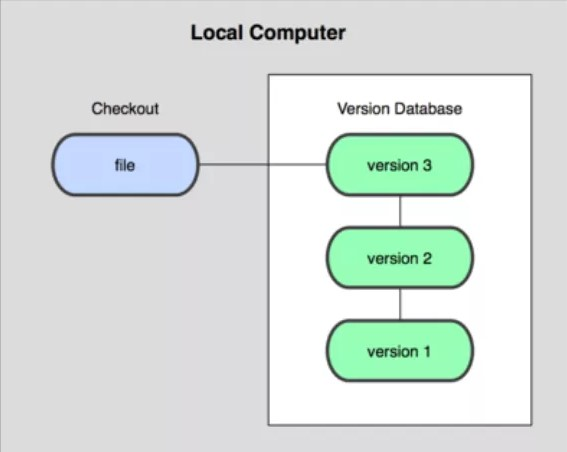

# Git

## 1. 版本控制

### 1.1 什么是版本控制

版本控制（Revision control）是一种在开发的过程中用于管理我们对文件、目录或工程等内容的修改历史，方便查看更改历史记录，备份以便恢复以前的版本的软件工程技术。

- 实现跨区域多人协同开发
- 追踪和记载一个或者多个文件的历史记录
- 组织和保护你的源代码和文档
- 统计工作量
- 并行开发、提高开发效率
- 跟踪记录整个软件的开发过程
- 减轻开发人员的负担，节省时间，同时降低人为错误

简单说就是用于管理多人协同开发项目的技术。

没有进行版本控制或者版本控制本身缺乏正确的流程管理，在软件开发过程中将会引入很多问题，如软件代码的一致性、软件内容的冗余、软件过程的事物性、软件开发过程中的并发性、软件源代码的安全性，以及软件的整合等问题。

无论是工作还是学习，或者是自己做笔记，都经历过这样一个阶段！我们就迫切需要一个版本控制工具！

### 1.2 常用的版本控制工具

- **Git**
- **SVN**（Subversion）
- **CVS**（Concurrent Versions System）
- **VSS**（Micorosoft Visual SourceSafe）
- **TFS**（Team Foundation Server）
- Visual Studio Online

### 1.3 版本控制分类

#### 1.3.1 本地版本控制

记录文件每次的更新，可以对每个版本做一个快照，或是记录补丁文件，适合个人用，如RCS。

 

#### 1.3.2 集中版本控制  SVN

所有的版本数据都保存在服务器上，协同开发者从服务器上同步更新或上传自己的修改

所有的版本数据都存在服务器上，用户的本地只有自己以前所同步的版本，如果不连网的话，用户就看不到历史版本，也无法切换版本验证问题，或在不同分支工作。而且，所有数据都保存在单一的服务器上，有很大的风险这个服务器会损坏，这样就会丢失所有的数据，当然可以定期备份。代表产品：SVN、CVS、VSS

#### 1.3.3 分布式版本控制 	Git

每个人都拥有全部的代码！安全隐患！

所有版本信息仓库全部同步到本地的每个用户，这样就可以在本地查看所有版本历史，可以离线在本地提交，只需在连网时push到相应的服务器或其他用户那里。由于每个用户那里保存的都是所有的版本数据，只要有一个用户的设备没有问题就可以恢复所有的数据，但这增加了本地存储空间的占用。

不会因为服务器损坏或者网络问题，造成不能工作的情况！

#### 1.3.4 Git与SVN的主要区别

SVN是集中式版本控制系统，版本库是集中放在中央服务器的，而工作的时候，用的都是自己的电脑，所以首先要从中央服务器得到最新的版本，然后工作，完成工作后，需要把自己做完的活推送到中央服务器。集中式版本控制系统是必须联网才能工作，对网络带宽要求较高。

Git是分布式版本控制系统，没有中央服务器，每个人的电脑就是一个完整的版本库，工作的时候不需要联网了，因为版本都在自己电脑上。协同的方法是这样的：比如说自己在电脑上改了文件A，其他人也在电脑上改了文件A，这时，你们两之间只需把各自的修改推送给对方，就可以互相看到对方的修改了。Git可以直接看到更新了哪些代码和文件！

## 2. Git环境配置

### 2.1 启动

**Git Bash：**Unix与Linux风格的命令行，使用最多，推荐最多

**Git CMD：**Windows风格的命令行

**Git GUI：**图形界面的Git，不建议初学者使用，尽量先熟悉常用命令

### 2.2 Git配置

所有的配置文件，其实都保存在本地！

查看全部配置 git config -l

查看系统配置 git config --system --list

查看当前用户（global）配置 git config --global -l

### 2.3 Git相关的配置文件

1）Git\etc\gitconfig  ：Git 安装目录下的 gitconfig   --system 系统级

2）C:\Users\14727\ .gitconfig   只适用于当前登录用户的配置（只有配置过global，该文件才会出现）  --global 全局

3）这里可以直接编辑配置文件，通过命令设置后会响应到这里。

### 2.4 设置用户名与邮箱

**必须配置**

当你安装Git后首先要做的事情是设置你的用户名称和e-mail地址。这是非常重要的，因为每次Git提交都会使用该信息。它被永远的嵌入到了你的提交中：

~~~she
git config --global user.name "haospring"
git config --global user.eamil "haospring123@gmail.com"
~~~

只需要做一次这个设置，如果你传递了--global 选项，因为Git将总是会使用该信息来处理你在系统中所做的一切操作。如果你希望在一个特定的项目中使用不同的名称或e-mail地址，你可以在该项目中运行该命令而不要--global选项。总之--global为全局配置，不加为某个项目的特定配置。

### 2.5 配置代理

~~~shell
git --global http.proxy "127.0.0.1:7890"
git --global https.proxy "127.0.0.1:7890"
~~~

 