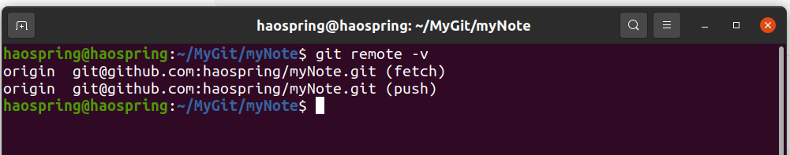

# Git

## 1. 版本控制

### 1.1 什么是版本控制

版本控制（Revision control）是一种在开发的过程中用于管理我们对文件、目录或工程等内容的修改历史，方便查看更改历史记录，备份以便恢复以前的版本的软件工程技术。

- 实现跨区域多人协同开发
- 追踪和记载一个或者多个文件的历史记录
- 组织和保护你的源代码和文档
- 统计工作量
- 并行开发、提高开发效率
- 跟踪记录整个软件的开发过程
- 减轻开发人员的负担，节省时间，同时降低人为错误

简单说就是用于管理多人协同开发项目的技术。

没有进行版本控制或者版本控制本身缺乏正确的流程管理，在软件开发过程中将会引入很多问题，如软件代码的一致性、软件内容的冗余、软件过程的事物性、软件开发过程中的并发性、软件源代码的安全性，以及软件的整合等问题。

无论是工作还是学习，或者是自己做笔记，都经历过这样一个阶段！我们就迫切需要一个版本控制工具！

### 1.2 常用的版本控制工具

- **Git**
- **SVN**（Subversion）
- **CVS**（Concurrent Versions System）
- **VSS**（Micorosoft Visual SourceSafe）
- **TFS**（Team Foundation Server）
- Visual Studio Online

### 1.3 版本控制分类

#### 1.3.1 本地版本控制

记录文件每次的更新，可以对每个版本做一个快照，或是记录补丁文件，适合个人用，如RCS。

 

#### 1.3.2 集中版本控制  SVN

所有的版本数据都保存在服务器上，协同开发者从服务器上同步更新或上传自己的修改

 

所有的版本数据都存在服务器上，用户的本地只有自己以前所同步的版本，如果不连网的话，用户就看不到历史版本，也无法切换版本验证问题，或在不同分支工作。而且，所有数据都保存在单一的服务器上，有很大的风险这个服务器会损坏，这样就会丢失所有的数据，当然可以定期备份。代表产品：SVN、CVS、VSS

#### 1.3.3 分布式版本控制 	Git

每个人都拥有全部的代码！安全隐患！

所有版本信息仓库全部同步到本地的每个用户，这样就可以在本地查看所有版本历史，可以离线在本地提交，只需在连网时push到相应的服务器或其他用户那里。由于每个用户那里保存的都是所有的版本数据，只要有一个用户的设备没有问题就可以恢复所有的数据，但这增加了本地存储空间的占用。

不会因为服务器损坏或者网络问题，造成不能工作的情况！

 

#### 1.3.4 Git与SVN的主要区别

SVN是集中式版本控制系统，版本库是集中放在中央服务器的，而工作的时候，用的都是自己的电脑，所以首先要从中央服务器得到最新的版本，然后工作，完成工作后，需要把自己做完的活推送到中央服务器。集中式版本控制系统是必须联网才能工作，对网络带宽要求较高。

Git是分布式版本控制系统，没有中央服务器，每个人的电脑就是一个完整的版本库，工作的时候不需要联网了，因为版本都在自己电脑上。协同的方法是这样的：比如说自己在电脑上改了文件A，其他人也在电脑上改了文件A，这时，你们两之间只需把各自的修改推送给对方，就可以互相看到对方的修改了。Git可以直接看到更新了哪些代码和文件！

## 2. Git环境配置

### 2.1 启动

**Git Bash：**Unix与Linux风格的命令行，使用最多，推荐最多

**Git CMD：**Windows风格的命令行

**Git GUI：**图形界面的Git，不建议初学者使用，尽量先熟悉常用命令

### 2.2 Git配置

所有的配置文件，其实都保存在本地！

`.gitconfig`, `.config/git`

查看全部配置 git config -l

查看系统配置 git config --<strong style="color:red;">system </strong>--list

查看全局配置 git config --global --list

查看某一项配置 git config user.name

查看当前用户（global）配置 git config --global -l

### 2.3 Git相关的配置文件

1）Git\etc\gitconfig  ：Git 安装目录下的 gitconfig   --system 系统级

2）C:\Users\14727\ .gitconfig   只适用于当前登录用户的配置（只有配置过global，该文件才会出现）  --global 全局

3）Ubuntu下，配置文件在`/home/haospring/.gitconfig`

4）这里可以直接编辑配置文件，通过命令设置后会响应到这里。

### 2.4 设置用户名与邮箱

**必须配置**

当你安装Git后首先要做的事情是设置你的用户名称和e-mail地址。这是非常重要的，因为每次Git提交都会使用该信息。它被永远的嵌入到了你的提交中：

~~~she
git config --global user.name "haospring"
git config --global user.email "haospring123@gmail.com"
~~~

只需要做一次这个设置，如果你传递了--global 选项，因为Git将总是会使用该信息来处理你在系统中所做的一切操作。如果你希望在一个特定的项目中使用不同的名称或e-mail地址，你可以在该项目中运行该命令而不要--global选项。总之--global为全局配置，不加为某个项目的特定配置。

### 2.5 配置代理

~~~shell
git config --global https.proxy "socks5://127.0.0.1:7890"
git config --global http.proxy "socks5://127.0.0.1:7890"

git config --global https.proxy "https://127.0.0.1:7890"
git config --global http.proxy "http://127.0.0.1:7890"

# 配置代理
git config --global https.proxy http://127.0.0.1:7890
git config --global https.proxy https://127.0.0.1:7890

# 取消代理
git config --global --unset http.proxy
git config --global --unset https.proxy

# 只对github.com设置代理
git config --global http.https://github.com.proxy socks5://127.0.0.1:7890
# 取消代理
git config --global --unset http.https://github.com.proxy
~~~


 

[参考链接](https://gist.github.com/laispace/666dd7b27e9116faece6)

### 2.6 配置编辑器

git在Linux上的默认编辑器是nano，可通过修改.gitconfig文件来修改默认编辑器，也可通过命令行修改

~~~shell
Linux：git config --global core.editor vim
Windows：git config --global core.editor path
~~~

### 2.7 Ubuntu设置git为英文

```shell
echo "alias git='LANG=en_GB git'" >> ~/.bashrc
```

### 2.8 生成公钥

Windows：在C:\Users\14727\ .ssh下生成公钥，如果没有.ssh文件夹，可以手动创建

Linux：`/home/haospring/.ssh`

~~~shell
ssh-keygen -t rsa
~~~

输入命令后一路回车即可在上述目录中创建`id_rsa.pub`

将文件中的内容配置到gitee或github上

### 2.9 查看版本

查看当前git版本 git --version

windows更新 git update-git-for-windows

## 3. Git基本理论

### 3.1 三个区域

Git本地有三个工作区域：<strong style="color:red;">工作目录</strong>（Working Directory）、<strong style="color:red;">暂存区</strong>(Stage/Index)、<strong style="color:red;">资源库</strong>(Repository或Git Directory)。如果在加上远程的git仓库(Remote Directory)就可以分为四个工作区域。文件在这四个区域之间的转换关系如下：

 

- Workspace：工作区，就是你平时存放项目代码的地方
- Index / Stage：暂存区，用于临时存放你的改动，事实上它只是一个文件，保存即将提交到文件列表信息
- Repository：仓库区（或本地仓库），就是安全存放数据的位置，这里面有你提交到所有版本的数据。其中HEAD指向最新放入仓库的版本
- Remote：远程仓库，托管代码的服务器，可以简单的认为是你项目组中的一台电脑用于远程数据交换

本地的三个区域确切的说应该是git仓库中HEAD指向的版本：

- Directory：使用Git管理的一个目录，也就是一个仓库，包含我们的工作空间和Git的管理空间。
- WorkSpace：需要通过Git进行版本控制的目录和文件，这些目录和文件组成了工作空间。
- .git：存放Git管理信息的目录，初始化仓库的时候自动创建。
- Index/Stage：暂存区，或者叫待提交更新区，在提交进入repo之前，我们可以把所有的更新放在暂存区。
- Local Repo：本地仓库，一个存放在本地的版本库；HEAD会只是当前的开发分支（branch）。
- Stash：隐藏，是一个工作状态保存栈，用于保存/恢复WorkSpace中的临时状态。

### 3.2 工作流程

1. 在工作目录中添加、修改文件；

2. 将需要进行版本管理的文件放入暂存区域；
3. 将暂存区域的文件提交到git仓库。

git管理的文件有三种状态：已修改（modified），已暂存（staged），已提交(committed)


## 4. Git项目搭建

### 4.1 本地仓库搭建

- 创建全新的仓库，需要用GIT管理的项目的根目录执行：

```shell
# 本地新建目录
mkdir test
# 进入目录
cd ./test
# 初始化仓库
git init
```

- 执行后可以看到，仅仅在项目目录多出了一个.git目录，关于版本等的所有信息都在这个目录里面。
- 配置`.gitignore`文件，格式规范如下
  - 所有空行或者以 # 开头的行都会被 Git 忽略。 
  - 可以使用标准的 glob 模式匹配，它会递归地应用在整个工作区中。 
  - 匹配模式可以以（/）开头防止递归。
  - 匹配模式可以以（/）结尾指定目录。
  - 要忽略指定模式以外的文件或目录，可以在模式前加上叹号（!）取反。
- .gitigonre [模板](https://github.com/github/gitignore)

### 4.2 克隆远程仓库

~~~shell
git clone [url]
git clone git@github.com:haospring/myNote.git
~~~

克隆远程仓库时可以自定义本地仓库的名字

~~~shell
git clone git@github.com:haospring/myNote.git myNote2
~~~

## 5. Git文件操作

### 5.1 文件的四种状态

版本控制就是对文件的版本控制，要对文件进行修改、提交等操作，首先要知道文件当前在什么状态，不然可能会提交了现在还不想提交的文件，或者要提交的文件没提交上。

- Committed: 已提交，即版本库中的文件快照内容与文件夹中完全一致。这种类型的文件有两种去处，如果它被修改，而变为Modified。如果使用git rm移出版本库， 则成为Untracked文件
- Staged: 暂存状态。执行git commit则将修改同步到库中，这时库中的文件和本地文件又变为一致。执行`git restore --staged filename`取消暂存，文件恢复到Modified状态
- Modified: 已修改，处于版本控制中的文件被修改，并没有进行其他的操作。通过git add可进入暂存staged状态
- Untracked: 未跟踪，此文件在文件夹中，但并没有加入到git库，不参与版本控制。通过git add 状态变为Staged

#### 5.1.1 git status

~~~shell
# 查看文件的状态
git status
# 添加文件
git add .
git add <filename>
# 提交到本地仓库
git commit -m "message"
# 将本地dev分支推送到远程仓库的dev分支
# 1.查看远程仓库地址，例：origin、base
git remote
# 2.查看远程分支
git branch -r
# 3.push到远程地址的远程分支
git push origin dev
~~~

以简短的方式查看文件状态

~~~shell
git status -s
git status --short
~~~

#### 5.1.2 git diff

`git diff` 此命令比较的是工作目录中当前文件和暂存区域快照之间的差异。 也就是修改之后还没有暂存起来的变化内容。

`git diff --staged` 和 `git diff -cached` 这条命令将比对已暂存文件与最后一次提交的文件差异

~~~shell
# 显示工作区和暂存区的区别
git diff
# 显示暂存区和上一次提交的区别
git diff --cached
git diff --staged
# 查看已暂存和未暂存的所有改动
git diff HEAD
~~~

 

- **第一行表示结果为git格式的diff** 

  `diff --git a/README.md b/README.md` 进行比较的是，a版本的README.md(即变动前)和b版本的README.md(即变动后)。

- **第二行表示两个版本的git哈希值和最后的六位数字是对象的模式**

  `index 794412d..d51ea75 100644`

  暂存区的794412d对象，与工作区的d51ea75 对象进行比较。`100`代表普通文件，`644`代表文件具有的权限（同linux文件权限）

- **第三四行表示进行比较的两个文件**

  `--- a/README.md`
  `+++ b/README.md`

   "---"表示变动前的版本，"+++"表示变动后的版本。

- **第五行表示代码变动的位置，用两个@作为起首和结束**

  `@@ -1,3 +1,6 @@`

  "-1,3″分成三个部分：减号表示第一个文件，"1″表示第1行，"3″表示连续3行。 合在一起，就表示下面是第一个文件从第1行开始的连续3行。

  "+1,6″表示变动后，成为第二个文件从第1行开始的连续6行。

  合在一起表示由第一个文件的1-3行变成第二个文件的1-6行

- **第三部分是变动的具体内容**

  `# 笔记` 表示没有修改的内容
  <strong style="color:red;">`-test`</strong> 表示第一个文件删除的行
  <strong style="color:green;">`+将这一行的内容由test修改为描述`</strong> 表示第二个文件新增的行
  ` test2`
  <strong style="color:green;">`+test3`</strong>
  <strong style="color:green;">`+test4`</strong>
  <strong style="color:green;">`+test5`</strong>

 

**git diff 中文乱码**

如果包含中文的文件使用 gbk2312 进行编码，`git diff`、`git log`、`git show` 等命令的输出结果会出现中文乱码。因为这些命令默认使用 `less` 进行分页，而`less` 无法识别 gbk2312 的编码格式，需要bash对 `less` 进行 utf-8 编码

~~~shell
# 只能当前终端生效，关闭终端重开则还是乱码
export LESSCHARSET=utf-8
# 需要写入.profile配置文件
echo "export LESSCHARSET=utf-8" >> ~/.profile
# 修改配置文件后刷新该文件，让配置立即生效
source ~/.profile
~~~

**git status 中文乱码**

~~~shell
git config --global core.quotepath false
~~~

[参考链接](https://www.jianshu.com/p/fc8162ed1e3d)

[参考链接](https://blog.csdn.net/bingyu9875/article/details/88196929)

[参考链接](https://blog.csdn.net/u012145252/article/details/81775362)

#### 5.1.3 git commit

提交文件前需要先使用 `git add <filename>` 将文件添加到暂存区

可以通过 `git commit -a` 跳过使用暂存区，Git会自动把所有已经跟踪过的文件暂存起来一并提交，从而跳过 `git add <filename>` 步骤

使用 `git commit --amend` 追加到上一笔提交，不会产生新的 commit log 记录

#### 5.1.4 git rm

要从 Git 中移除某个文件，就必须要从已跟踪文件清单中移除（确切地说，是从暂存区域移除），然后提交。

~~~shell
# 使用 git rm 删除文件
git rm test.txt
git commit -m "测试git rm"
# 使用 rm 删除文件，需要添加到暂存区并提交
rm test.txt
git add .
git commit -m "删除test.txt文件"
# 删除暂存区文件，但是不删除本地文件，本地文件变成未跟踪状态
git rm --cached test.txt
~~~

#### 5.1.5 git mv

相当于运行一下三条命令

`mv test.txt test2.txt`

`git rm test.txt`

`git add test2.txt`

#### 5.1.6 git remote

1. 查看远程地址

~~~shell
git remote
git remote -v
~~~

 

2. 查看远程仓库详细信息

~~~shell
git remote show origin
~~~

 

3. 添加远程版本库，将本地与远程仓库关联，需要远程仓库存在

~~~shell
# git remote add [shortname] [url]，shortname为远程地址别名
git remote add origin git@github.com:haospring/Test.git
~~~

 

4. 首次关联远程仓库

~~~shell
git push -u origin master
~~~

 

5. 取消与远程库的关联

~~~shell
git remote rm origin
~~~

 

[https://www.runoob.com/git/git-remote.html](https://www.runoob.com/git/git-remote.html)

#### 5.1.7 git rebase

将多比提交合并为一笔

~~~shell
git rebase -i HEAD~3
~~~

[https://docs.github.com/cn/get-started/using-git/about-git-rebase](https://docs.github.com/cn/get-started/using-git/about-git-rebase)

#### 5.1.8 git branch -m

分支重命名

~~~shell
# 重命名当前分支 e.g.将当前分支重命名为main
git branch -m main
# 重命名指定分支
git branch -m oldname newname
# 强制重命名，若存在与新命名分支相同的分支，则删除原分支，重新创建分支
git branch -M oldname newname
~~~

### 5.2 忽略文件

有些时候我们不想把某些文件纳入版本控制中，比如数据库文件，临时文件，设计文件等

在主目录下建立".gitignore"文件，此文件有如下规则：

1. 忽略文件中的空行或以井号（#）开始的行将会被忽略。
2. 可以使用Linux通配符。例如：星号（*）代表任意多个字符，问号（？）代表一个字符，方括号（[abc]）代表可选字符范围，大括号（{string1,string2,...}）代表可选的字符串等。
3. 如果名称的最前面有一个感叹号（!），表示例外规则，将不被忽略。
4. 如果名称的最前面是一个路径分隔符（/），表示要忽略的文件在此目录下，而子目录中的文件不忽略。
5. 如果名称的最后面是一个路径分隔符（/），表示要忽略的是此目录下该名称的子目录，而非文件（默认文件或目录都忽略）。

~~~shell
#为注释
*.txt        #忽略所有.txt结尾的文件，这样的话上传就不会被选中！
!lib.txt     #但lib.txt除外
/TODO        #只忽略当前目录下的TODO文件，不忽略subdir/TODO
build/       #忽略任何目录下名为 build 的文件夹
doc/*.txt    #会忽略 doc/notes.txt 但不包括 doc/server/arch.txt
doc/**/*.pdf #忽略doc/目录及其子目录下的.pdf文件
~~~

### 5.3 获取帮助

方式一：git help <verb>

`git help add`

`git help branch`

方式二：git <verb> --help

`git config --help`

方式三：git <verb>  -h

`git add -h`

## 6. 版本回退

### 6.1 历史记录

不传入任何参数的默认情况下，`git log` 会按时间先后顺序列出所有的提交，最近的更新排在最上面。这个命令会列出每个提交的 SHA-1 校验和、作者的名字和电子邮件地址、提交时间以及提交说明。

~~~shell
git log
~~~

 

显示上一次版本提交的信息，只显示一行

~~~shell
git log --pretty=oneline
~~~

 

版本回退

--hard：工作区，暂存区，版本库全部回退

--mixed：默认，工作区、暂存区回退

--soft：工作区回退

~~~shell
# 回退到上一个版本
git reset --hard HEAD^
git reset --hard head~
# 回退到上两个版本
git reset --hard HEAD^^
git reset --hard head~~
# 回退到上100个版本
git reset --hard HEAD~100
# 回退到指定的版本，版本号可以不写全，自动匹配
git reset --hard 09fff1
~~~

查看每一次操作的版本号，根据版本号回退

~~~shell
git reflog
~~~

查看工作区和版本库里面最新版本的区别

~~~shell
git diff HEAD -- readme.txt
~~~

#### 6.1.1 git log --patch

`-p` 或 `--patch` ，它会显示每次提交所引入的差异（按 **补丁** 的格式输出）。 

可以限制显示的日志条目数量，例如使用 `-2` 选项来只显示最近的两次提交。

该选项除了显示基本信息之外，还附带了每次提交的变化。

~~~shell
git log --patch -2
git log -p -2
~~~

 

#### 6.1.2 git log --stat

想看到每次提交的简略统计信息，可以使用 `--stat` 选项

`--stat` 选项在每次提交的下面列出所有被修改过的文件、有多少文件被修改了以及被修改过的文件的哪些行被移除或是添加了。 在每次提交的最后还有一个总结。

~~~shell
git log --stat -3
~~~

 

#### 6.1.3 git log --pretty

`--pretty`，这个选项可以使用不同于默认格式的方式展示提交历史。 

这个选项有一些内建的子选项供你使用。 比如 `oneline` 会将每个提交放在一行显示，在浏览大量的提交时非常有用。 

另外还有 `short`，`full` 和 `fuller` 选项，它们展示信息的格式基本一致，但是详尽程度不一

 

#### 6.1.4 git log --graph

在日志旁以 ASCII 图形显示分支与合并历史。

可以搭配`--pretty=oneline`或`--pretty=format`使用。

~~~shell
git log --pretty=oneline --graph
~~~

 

#### 6.1.5 限制输出长度

| 选项                  | 说明                                       |
| :-------------------- | :----------------------------------------- |
| `-<n>`                | 仅显示最近的 n 条提交。                    |
| `--since`, `--after`  | 仅显示指定时间之后的提交。                 |
| `--until`, `--before` | 仅显示指定时间之前的提交。                 |
| `--author`            | 仅显示作者匹配指定字符串的提交。           |
| `--committer`         | 仅显示提交者匹配指定字符串的提交。         |
| `--grep`              | 仅显示提交说明中包含指定字符串的提交。     |
| `-S`                  | 仅显示添加或删除内容匹配指定字符串的提交。 |

~~~shell
git log --since=2.weeks
git log --since=2021-05-06
git log --grep=修改
git log --author=ha
~~~

### 6.2 撤销修改

有时候我们提交完了才发现漏掉了几个文件没有添加，或者提交信息写错了。 此时，可以运行带有 --amend 选项的提交命令来重新提交：

~~~shell
git commit --amend
~~~

放弃工作区的修改，让这个文件回到最近一次`git commit`或`git add`时的状态

~~~shell
git restore <file>
# 旧版本git
git checkout <file>
~~~

修改只是添加到了暂存区，还没有提交，撤销修改，重新放回工作区

~~~shell
git restore --staged <file>
~~~

从暂存区提交到了版本库，还没有把自己的本地版本库推送到远程，回退到上一个版本

~~~shell
git reset --hard HEAD^
~~~

### 6.3 删除文件

本地删除文件，版本库中也要删除文件

~~~shell
git rm||add hello.txt
git commit -m "delete hello.txt"
~~~

本地误删文件，从版本库恢复

~~~shell
git restore hello.txt
~~~

## 7. 远程仓库

### 7.1 判断是否成功连接 github

~~~shell
ssh -T git@github.com
~~~

 

可以添加多个远程仓库，github仓库和gitee仓库同时关联本地，要起不同的远程名

1. 将本地仓库与新建的远程仓库关联

~~~shell
# git remote add [远程地址别名（origin、base）] [url]
git remote add origin git@github.com:haospring/LearnGit.git
~~~

2. 查看本地仓库的远程仓库信息

~~~shell
git remote -v
~~~

 

3. 删除已有的远程库

~~~shell
git remote rm origin
~~~

4. 将本地仓库内容推送到远程仓库，首次提交加上-u，需要指定本地分支

~~~shell
# git push <remote> <branch>
git push -u origin main
~~~

## 8. 分支

### 8.1 创建与合并分支

1. 创建分支

~~~shell
git checkout -b dev || git switch -c dev
# -b表示创建并切换，相当于以下两条语句的合并
# git branch dev，创建分支
# git checkout dev || git swtich dev 切换分支

# 创建与远程分支相同的分支
git switch -c dev origin/dev
~~~

2. 查看当前分支，显示所有分支

~~~shell
# 列出本地分支及当前分支
git branch
# 列出所有远程分支
git branch -r
# 列出所有分支
git branch -a
~~~

3. 将本地分支的修改推送到远程对应的分支上，必须指定本地分支

~~~shell
git push origin <branch>
~~~

4. 创建远程分支

~~~shell
# 1.创建并切换到本地分支
git checkout -b dev
# 2.指定本地其他分支合并到当前分支
git merge master
# 3.查看远程分支地址
git remote
# 4.将当前分支推送到远程，自动创建远程分支，远程分支名任意
git push base dev:dev
~~~

 

5. 切换分支

~~~shell
git checkout dev
# 新版本git可以使用git switch dev来切换分支
~~~

5. 合并分支，合并指定分支到当前分支

~~~shell
git merge dev
~~~

6. 建立本地分支和远程分支的关联

~~~shell
# 老版本git
git branch --set-upstream branch-name origin/branch-name
# 新版本git
git branch --track base/dev
~~~

 

7. 删除分支

~~~shell
# 删除本地分支
git branch -d dev
# 删除远程分支，有两种方式，第一种：直接删除远程分支
git push origin --delete [branch-name]
# 第二种：推送一个空分支到远程分支
git push base :dev
~~~

 

 

说明：合并两个分支时可能报错fatal: refusing to merge unrelated histories

~~~shell
git merge master --allow-unrelated-histories -m "message"
~~~

git pull和git push也可能出现该错误，操作同上

### 8.2 解决冲突

- 个人开发

1. feature1分支修改了text.txt的最后一行内容
2. main分支修改了text.txt的最后一行内容，且和feature1的内容不一致
3. git merge feature1时合并分支失败，存在冲突
4. 将冲突的文件修改一致，提交成功
5. 删除feature1分支

- 团队合作

1. 首先，可以试图用`git push origin <branch-name>`推送自己的修改；
2. 如果推送失败，则因为远程分支比你的本地更新，需要先用`git pull`试图合并；
3. 如果合并有冲突，则解决冲突，并在本地提交；
4. 没有冲突或者解决掉冲突后，再用`git push origin <branch-name>`推送就能成功！

## 9. 标签管理

### 9.1 创建标签

1. 切换到需要打标签的分支上
2. git tag <tagname> 默认标签打在最新提交的commit上
3. 可以通过git tag 查看所有标签
4. 通过 git log --pretty=oneline --abbrev-commit 查看所有的commit id
5. git tag <tagname> -m "message" <commit id> 给指定的commit打标签
6. git show <tagname>查看打标签时的说明文字

### 9.2 操作标签

1. git tag -d <tagname> 删除指定的标签
2. 创建的标签只存储在本地，不会推送到远程仓库
3. 将标签推送到远程 git push origin <tagname>
4. 推动全部标签到远程 git push origin --tags
5. 删除远程标签
   1. 首先删除本地标签 git tag -d <tagname>
   2. 删除远程标签 git push origin :refs/tags/tagname

## 6. IDEA中集成Git

1、将远程仓库克隆到本地，将目录中的内容拷贝到IDEA项目的工作目录

2、修改文件，使用IDEA操作git。

- 添加到暂存区
- commit 提交
- push到远程仓库

3、提交测试

## 说明 Git分支

Git分支常用命令

如果同一个文件在合并分支时都被修改了则会引起冲突：解决的办法是我们可以修改冲突文件后重新提交！选择要保留他的代码还是你的代码！

master主分支应该非常稳定，用来发布新版本，一般情况下不允许在上面工作，工作一般情况下在新建的dev分支上工作，工作完后，比如上要发布，或者说dev分支代码稳定后可以合并到主分支master上来。

