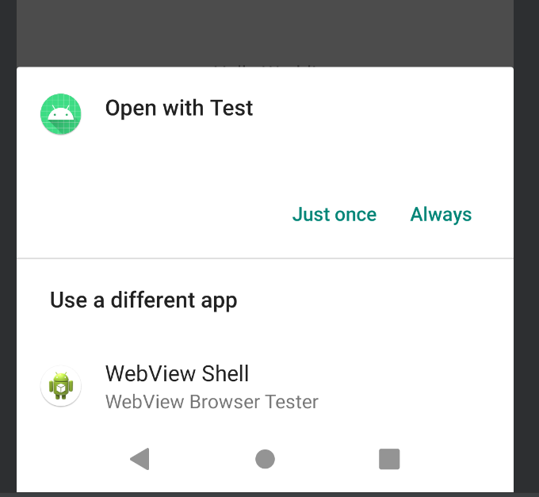

## Intent

### 启动 Activity 报异常

*android.content.ActivityNotFoundException: No Activity found to handle Intent { act=com.thundersoft.testnotification.activity.SecondActivity }*

~~~java
Intent intent = new Intent();
intent.setAction("com.thundersoft.testnotification.activity.SecondActivity");
startActivity(intent);
~~~

需要给 activity 设置 category 属性

~~~xml
<!-- 如果在AndroidManifest.xml 文件中设置 category 为默认，则 intent 可以不设置 category -->
<category android:name="android.intent.category.DEFAULT" />

<!-- 如果设置的 category 为自定义的，则需要在设置 intent 的 category -->
<category android:name="com.thundersoft.testnofification.mycategory" />
~~~

~~~java
intent.addCategory("com.thundersoft.testnofification.mycategory");
~~~

*note：要想对一个Activity进行隐式启动，必须给Activity设置默认的Categroy，否则会匹配失败*
可以通过PackageManager的resolveActivity(Intent，flag) 方法判断符合匹配规则的Activity是否存在

~~~java
Intent intent = new Intent();
intent.setAction("com.haospring.test.SecondActivity");
intent.addCategory("com.haospring.test.SecondActivity.Category");
// android 7.0 之后文件匹配只能使用 content，不能使用 file
intent.setDataAndType(Uri.parse("content://abc"), "text/plain");

ResolveInfo resolveInfo = getPackageManager().resolveActivity(nextIntent, PackageManager.MATCH_DEFAULT_ONLY);
if (resolveInfo != null) {
    startActivity(intent);
}
~~~

~~~xml
<activity
          android:name=".SecondActivity"
          android:exported="false"
          android:taskAffinity="com.haospring"
          android:launchMode="singleTask">
    <intent-filter>
        <action android:name="com.haospring.test.SecondActivity" />

        <category android:name="com.haospring.test.SecondActivity.Category" />
        <category android:name="android.intent.category.DEFAULT" />

        <data
              android:mimeType="text/plain"
              android:scheme="content" />
    </intent-filter>

    <intent-filter tools:ignore="AppLinkUrlError">
        <action android:name="android.intent.action.VIEW" />
        <category android:name="android.intent.category.DEFAULT" />
        <data android:scheme="http" />
    </intent-filter>
</activity>
~~~

~~~java
Intent intent = new Intent();
intent.setAction(Intent.ACTION_VIEW);
intent.addCategory(Intent.CATEGORY_DEFAULT);
intent.setData(URI.parse("http://www.baidu.com"));
startActivity(intent);
~~~

因为上面的 Intent 的过滤规则既匹配 SecondActivity，由匹配手机浏览器的 Activity，所以会打开两个Activity可以让用户选择，但是 SecondActivity 是没有打开网页的能力的。

 

### 隐式启动 Service

~~~java
Intent intent = new Intent();
intent.setAction("com.thundersoft.testnotification.service.TestForegroundService");
intent.setPackage("com.thundersoft.testnotification");
startService(intent);
~~~

隐式启动 Service 必须指定包名

包名是组件的包名，不是 Service 类的包名，不是 `com.thundersoft.testnotification.service`

###　Intent 的属性

ComponentName，Action，Category，Data，Type，Extra，Flags

#### Flags: 

Intent.FLAG_ACTIVITY_CLEAR_TOP：类似于 activity 的 launchMode 为 singleTask

Intent.FLAG_ACTIVITY_SINGLE_TOP：singleTop

Intent.FLAG_ACTIVITY_NEW_TASK：singleInstance

**e.g. 依次启动A 、B、C、D，然后从 D 跳转到 B，同时希望 C、D都finish掉**

方式一：Intent 设置 Flags 属性为 Intent.FLAG_ACTIVITY_CLEAR_TOP

方式二：在 AndroidManifest.xml 中给 B 添加属性 launchMode = "singleTask"

#### ComponentName

~~~java
Intent intent = new Intent();
Intent intent = new Intent();
intent.setComponent(new ComponentName("com.thundersoft.testnotification", "com.thundersoft.testnotification.activity.SecondActivity"));

// 等价于
Intent intent = new Intent(getApplicationContext(), SecondActivity.class);
~~~

*note:* 包名指的是组件所在的包名，而不是类所在的包名，包名是 `com.thundersoft.testnotification`，而不是 `com.thundersoft.testnotification.activity`

类名需要包含类的详细路径，也就是`包名+类名`

### 参考链接

[https://www.cnblogs.com/SanguineBoy/p/9785585.html](https://www.cnblogs.com/SanguineBoy/p/9785585.html)

