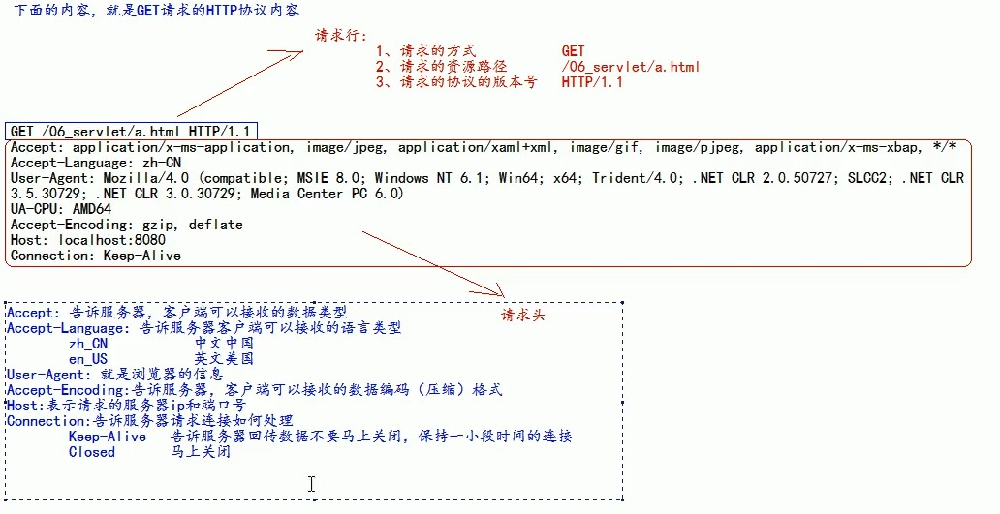
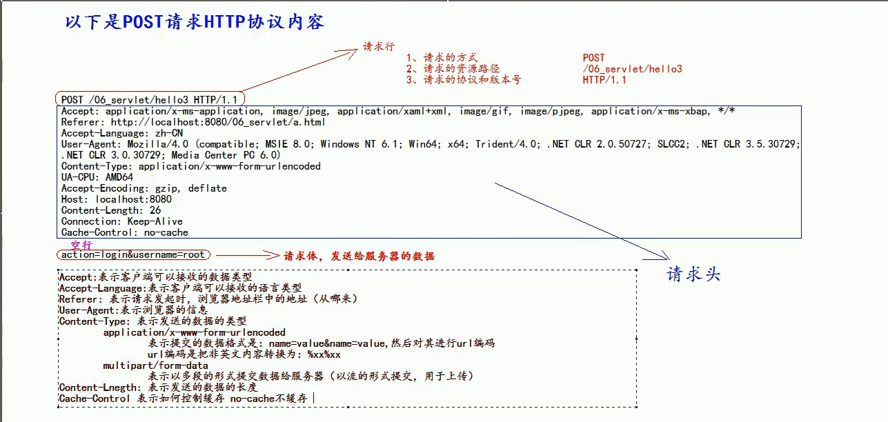

# Servlet

## 什么是Servlet

- Servlet是JavaEE规范之一。规范就是借口
- Servlet是JavaWeb三大组件之一。三大组件分别是Servlet程序、Filter过滤器、Listener监听器
- Servlet是运行在服务器上的一个java小程序，它可以接受客户端发过来的请求，并响应数据给客户端

## 手动实现Servlet程序

1. 编写一个类去实现Servlet借口
2. 重写service方法，处理请求，并响应数据
3. 到web.xml中去配置servlet程序的访问地址

~~~java
<!-- 给Tomcat配置Servlet程序 -->
    <servlet>
        <!-- 给Servlet程序起一个别名，一般是类名 -->
        <servlet-name>HelloServlet</servlet-name>
        <!-- Servlet程序的全类名 -->
        <servlet-class>com.haospring.servlet.HelloServlet</servlet-class>
    </servlet>

    <!-- 给Servlet程序配置访问地址 -->
    <servlet-mapping>
        <!-- 告诉服务器当前配置的地址给哪个Servlet程序使用 -->
        <servlet-name>HelloServlet</servlet-name>
        <!-- 配置访问地址
            / 斜杠在服务器解析的时候，表示地址为：http://ip:port/工程路径
            /hello 表示地址为http://ip:port/工程路径/hello
         -->
        <url-pattern>/hello</url-pattern>
    </servlet-mapping>
~~~

## Servlet的生命周期

1. 执行Servlet构造器方法
2. 执行init初始化方法
3. 执行service方法
4. 执行destroy销毁方法

前两个步骤是在第一次访问，创建Servlet的时候调用，只调用一次

第三步是每次访问都会调用

第四步是在web工程停止的时候调用

## 继承Servlet实现类HttpServlet

1. 编写一个类继承HttpServlet类
2. 根据业务需要重写doGet和doPost方法
3. 到web.xml中配置Servlet程序的访问地址

## ServletConfig

### ServletConfig的作用

1. 可以获取Servlet程序的别名servlet-name
2. 获取初始化参数init-param
3. 获取ServletContext对象

## ServletContext

1. 是一个接口，它表示Servlet上下文对象
2. 一个web工程，只有一个ServletContext实例
3. ServletContext对象是一个域对象
   1. 域对象是可以像Map一样存取数据的对象，叫域对象
   2. 这里的域指的是存取数据的操作范围

作用：

1. 获取web.xml中配置的上下文参数context-param
2. 获取当前的工程路径，格式：/工程名
3. 获取工程部术后在服务器磁盘上的绝对路径
4. 像Map一样存取数据

## Http协议

### 什么是http协议

http协议就是指客户端和服务器之间通信时发送的数据需要遵守的规则

http协议中的数据又叫报文

### 请求的http协议

客户端给服务器发送数据叫请求

服务器给客户端回传数据叫响应

#### GET请求

1. 请求行

   （1）请求的方式											GET

   （2）请求的资源路径[+?+请求参数]

   （3）请求的协议和版本号							HTTP/1.1

2. 请求头

   （1）key:value		组成		不同的键值对表示不同的含义

#### POST请求

1. 请求行

   （1）请求的方式											POST

   （2）请求的资源路径[+?+请求参数]

   （3）请求的协议和版本号							HTTP/1.1

2. 请求头

   （1）key:value		组成		不同的键值对表示不同的含义

   空行

3. 请求体       发送给服务器的数据

### 哪些是GET请求，哪些是POST请求

#### get请求有哪些

1. form标签method属性get
2. a标签
3. link标签引入css文件
4. script属性引入js文件
5. img标签引入图片
6. iframe引入html文件
7. 在浏览器地址栏中输入地址回车

#### post请求有哪些

form标签method属性post

### 响应的http协议格式

1. 响应行

   （1）响应的协议和版本号

   （2）响应状态码

   （3）响应状态描述符

2. 响应头

   （1）key:value

3. 响应体     回传给客户端的数据

#### 常用的响应码说明

1. 200					表示请求成功
2. 302                    表示请求重定向
3. 404                    表示请求服务器已经收到，但需要的数据不存在（请求地址错误）
4. 500                    表示服务器已经收到请求，但是服务器内部错误（代码错误）

## HttpServletRequest类

每次只要有请求进入Tomcat服务器，Tomcat服务器就会把请求过来的http协议信息解析好封装到Request对象中，传递到service方法（doGet、doPost）中给我们使用，我们可以通过HttpServletRequest对象，获取所有请求的信息

#### 常用方法

getRequestURI()						获取请求的资源路径

getRequestURL()		   			获取请求的同意资源定位符（绝对路径）

getRemoteHost()					   获取客户端的ip地址

getHeader()								获取请求头

getParameter()						  获取请求的参数

getParameterValues()			  获取请求的参数（多个值时使用）

getMethod()							   获取请求的方式（get或post）

setAttribute(key,value)			设置域数据

getAttribute(key,value)			获取域数据

getRequestDispatcher()		   获取请求转发对象

设置请求体的字符集为UTF-8，从而解决post请求的中文乱码问题

必须在获取请求参数之前设置才有效

req.setCharacterEncoding("UTF-8");

## 请求的转发

请求转发是指，服务器收到请求后，从一个资源跳转到另一个资源的操作叫请求转发

base标签设置页面相对路径工作室参照的路径，href属性就是参照的地址值，放在title的下面

### web中/斜杠的不同意义

在web中/是一种绝对路径

1. / 如果被浏览器解析，得到的地址是：http://ip:port/

   （1）\<a href="/">斜杠</a>

2. / 如果被服务器解析，得到的地址是：http://ip:port/工程名

   （1）<url-pattern>/servlet1<url-pattern>

   （2）servletContext.getRealPath("/");

   （3）request.getRequestDispatcher("/");

3. 特殊情况：respose.sendRediect("/")

   把斜杠发送给浏览器解析。得到http://ip:port/

## HttpServletResponse类

HttpServletResponse类和HttpServletRequest类一样。每次请求进来，Tomcat服务器都会创建一个Response对象传递给Servlet程序去使用。HttpServletRequest表示请求过来的信息，HttpServletResponse表示响应的信息。我们需要设置返回给客户端的信息，都可以通过Response对象设置

### 两个输出流

字节流			getOutputStream		常用于下载（传递二进制数据）

字符流			getWriter					   常用于回传字符串（常用）

两个流不能同时使用，否则就会报错

### 往客户端回传字符串

修改响应服务器的编码和浏览器接收的编码

### 请求重定向

